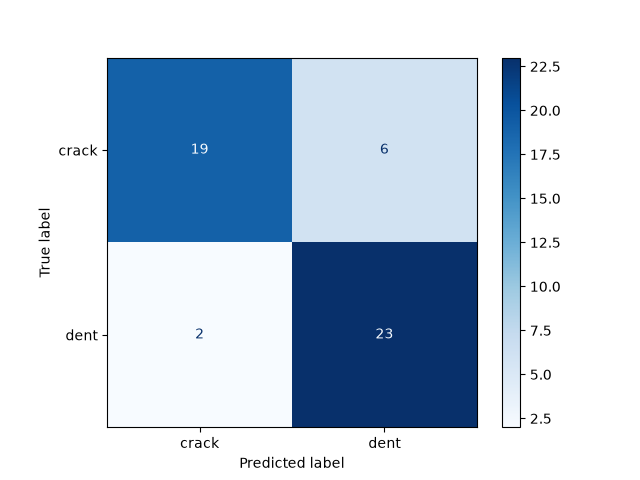

DAMAGESCAN
Classification automatique des dommages structurels sur avions (bosse vs fissure) grâce au transfer learning avec VGG16.
Ce projet démontre un pipeline complet de vision par ordinateur : depuis les données brutes jusqu'à un modèle de deep learning entraîné, évalué et interprétable, conçu pour une application réelle dans la maintenance et l'inspection aéronautique.

1. PRÉSENTATION DU PROJET

L'inspection manuelle des avions est longue et sujette aux erreurs humaines. Ce projet automatise la détection et la classification des dommages structurels à partir d'images, en utilisant le Transfer Learning (VGG16) pré-entraîné sur ImageNet, adapté pour une classification binaire (bosse/fissure).
Un module de génération de légendes d'images (basé sur un modèle Transformer, BLIP) est prévu comme extension future — voir la section Améliorations Futures ci-dessous.

2. RÉSULTATS

Après 10 epochs d'entraînement, le modèle atteint une accuracy de 95.3% sur les données d'entraînement et 77.1% sur les données de validation, avec une loss finale de 0.12 (train) et 0.43 (validation).

Matrice de Confusion (Ensemble Test) :

L'historique complet d'entraînement (accuracy/loss par epoch) est disponible dans outputs/training_history.json

3. ARCHITECTURE

Le modèle repose sur VGG16, un réseau de convolution pré-entraîné sur ImageNet, utilisé comme extracteur de features et gelé pendant l'entraînement (14,7 millions de paramètres non-entraînables).
À la sortie de VGG16, une couche Flatten aplatit les features (25 088 valeurs), suivie d'une couche Dense de 256 neurones avec activation ReLU, d'une couche Dropout (0.5) pour limiter l'overfitting, et enfin d'une couche Dense finale à 1 neurone avec activation Sigmoid, qui produit la probabilité de classification entre "crack" et "dent".
Le modèle compte au total 21,1 millions de paramètres, dont 6,4 millions entraînables (nos couches ajoutées) et 14,7 millions gelés (VGG16 pré-entraîné).

4. STRUCTURE DU PROJET

damage_scan/
├── data/                          Dataset d'images (train/valid/test, non inclus)
├── src/
│   ├── explore_data.py            Exploration et visualisation des images
│   ├── preprocess.py              Chargement et préparation des données
│   ├── model.py                   Architecture VGG16 + couches personnalisées
│   ├── train.py                   Entraînement et sauvegarde du modèle
│   ├── evaluate.py                Évaluation sur l'ensemble test
│   ├── visualize_results.py       Génération de la matrice de confusion
│   └── caption_generator.py       Génération de légendes via BLIP (en cours)
├── models/                         Modèle entraîné (.keras) - non inclus dans le repo
├── outputs/                       Historique d'entraînement + matrice de confusion
├── requirements.txt                Liste des dépendances
└── README.md

5. INSTALLATION ET UTILISATION

a) Cloner le dépôt avec git clone <lien-de-ton-repo> puis se placer dans le dossier avec cd damage_scan
b) Créer un environnement virtuel avec Python 3.11 : py -3.11 -m venv venv puis l'activer avec venv\Scripts\activate
c) Installer les dépendances avec pip install -r requirements.txt
d) Télécharger le dataset avec Invoke-WebRequest -Uri "https://cf-courses-data.s3.us.cloud-object-storage.appdomain.cloud/ZjXM4RKxlBK9__ZjHBLl5A/aircraft-damage-dataset-v1.tar" -OutFile "data/aircraft-damage-dataset-v1.tar" puis l'extraire avec tar -xvf data/aircraft-damage-dataset-v1.tar -C data/
e) Exécuter le pipeline complet dans l'ordre : python src/train.py pour entraîner le modèle, python src/evaluate.py pour l'évaluer sur l'ensemble test, puis python src/visualize_results.py pour générer la matrice de confusion

6. CONCEPTS CLÉS DÉMONTRÉS

Ce projet met en pratique le Transfer Learning, qui consiste à réutiliser un CNN pré-entraîné (VGG16) comme extracteur de features fixe pour compenser un dataset limité. Il illustre également la classification binaire d'images à l'aide d'une tête de classification personnalisée (Dense + Dropout + Sigmoid), ainsi que la méthodologie Train/Validation/Test, essentielle pour détecter l'overfitting et garantir une évaluation honnête des performances. Enfin, le projet démontre l'interprétabilité d'un modèle grâce à l'analyse de la matrice de confusion.

7. AMÉLIORATIONS FUTURES
Plusieurs axes d'amélioration sont envisagés pour ce projet : finaliser l'intégration du module de génération de légendes BLIP (basé sur un modèle Transformer), actuellement en cours de développement ; appliquer de la data augmentation pour réduire l'overfitting et améliorer l'accuracy de validation ; effectuer un fine-tuning des couches supérieures de VGG16 (dégel partiel) pour une meilleure adaptation des features ; agrandir le dataset pour une meilleure généralisation ; et déployer le modèle sous forme d'application web (Streamlit ou Flask) pour permettre de l'inférence interactive.

8. DATASET
Le dataset utilisé provient de Aircraft Damage Dataset, fourni via Roboflow, sous licence CC BY 4.0.

9. AUTEUR
Ce projet a été développé par : Yassine Joudi